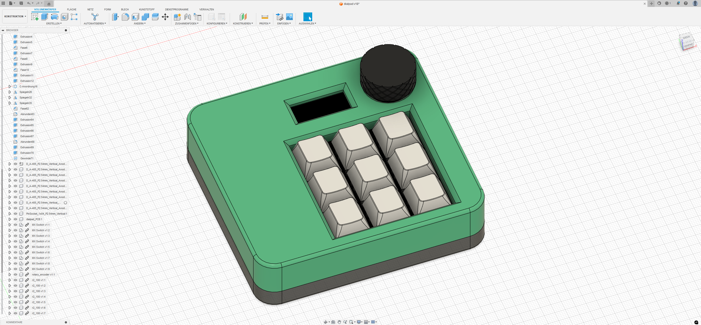
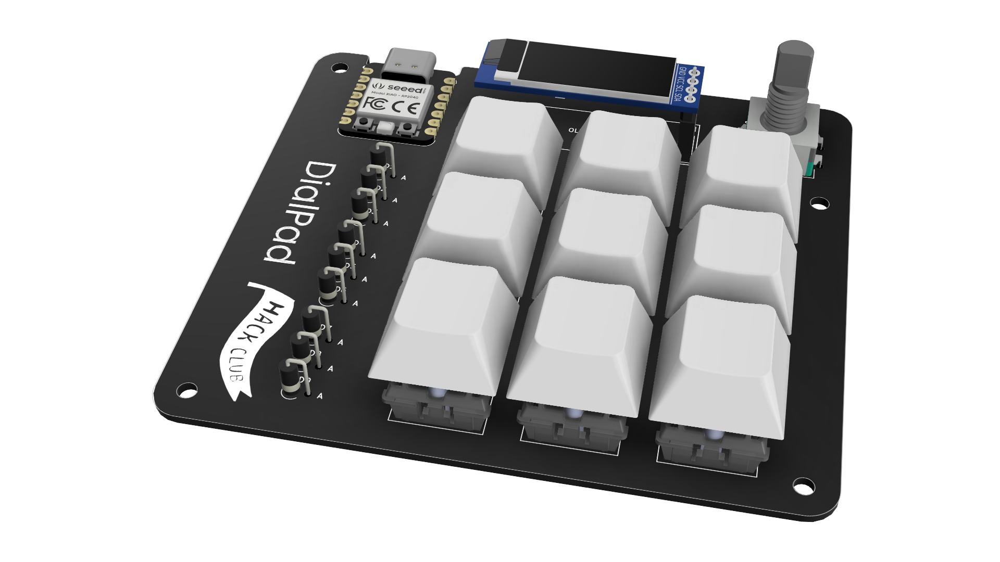
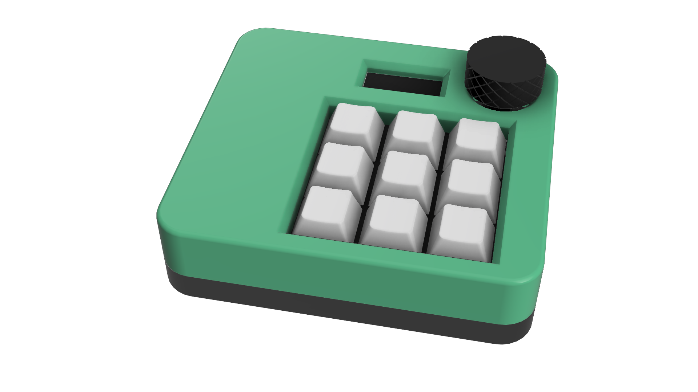
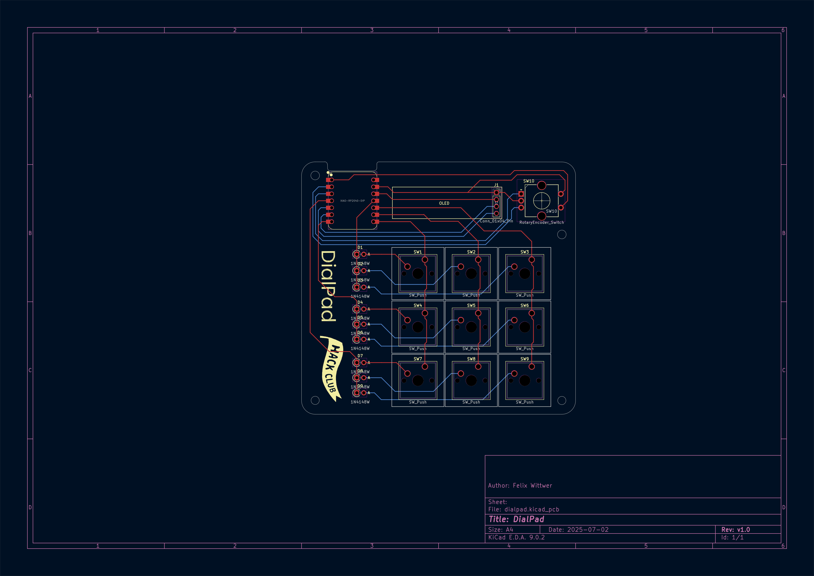
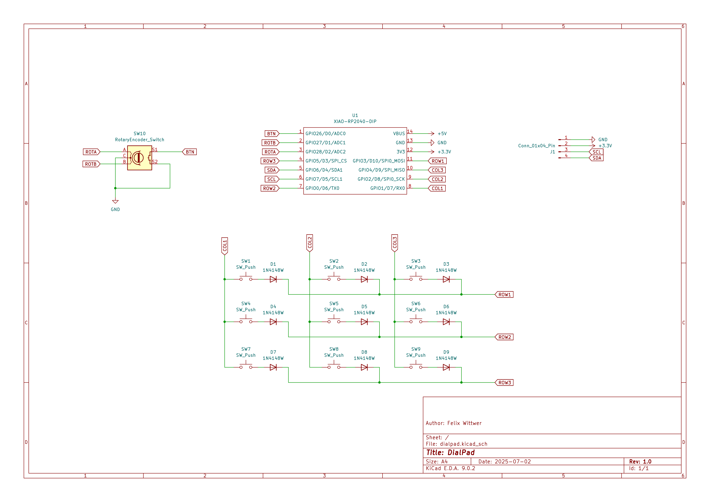

 
 

   
   

 

# DialPad
a small Macropad with 9 keys, a rotary encoder and a small oled screen.

Now a screenshot with a lot of elemnts inside Fosion to make it look cool.

 
 
 

  
  

I have designed the to part to be this green color but I am probably printign it transparent with my SLA Esin printer so the left area doesn't look so empty. If translucent you can see some electronics 👀.

## PCB and Schematics

Some nice and clean schematics and a my PCB design. Nothing to creative but it has a little touch of Hacclub in it.

  
  

## Assembly

Just a very cool animation on how to assemble the DialPad. 

## Firmware

KMK with support for the dial and OLED screen. I will maybe further develop the firmware with macros and layers which will be shown on the screen but for now ith will be a numpad with a media controll dial.

- KMK

## BOM

- 9x Cherry MX Switches
- 9x DSA Keycaps
- 4x M3x16mm screws (heated inserts are not needed I am printing with SLA and Resin so threads are already in the design)
- 9x 1N4148 DO-35 Diodes.
- 1x 0.91" 128x32 OLED Display
- 1x EC11 Rotary Encoder
- 1x XIAO RP2040
- 1x Case (3 printed parts)