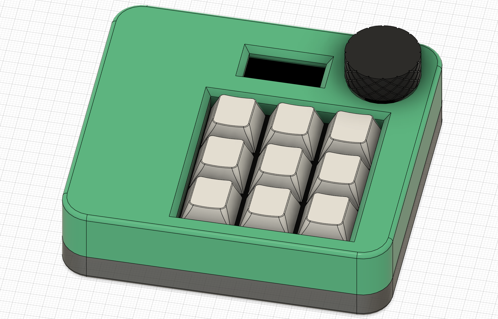

# CAD

this folder conatins everything regarding the CAD design.

You can find the complete Hackpad assembled as .step and .3mf files here.
Furtherome you have access to the files I exported form KiCad to design a Case around it. (I exportet as .step from KiCad and because the silkscreen isn't transfered I printed the silkscreen only as .pdf and the rendered a .png of it with Inkscape. The .png was later inserted into Fusion360)

