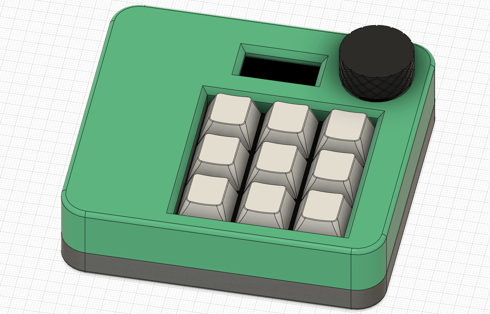

# Production

This folder contains all stuff regarding production files.

- you can find the PCB production files as gerber.zip
- the top and bottom case in .stp format or directly as .stl for 3D printing
- a knob for the rotary encoder with a nice knurling around it as .stp or .stl for 3D printing

 

